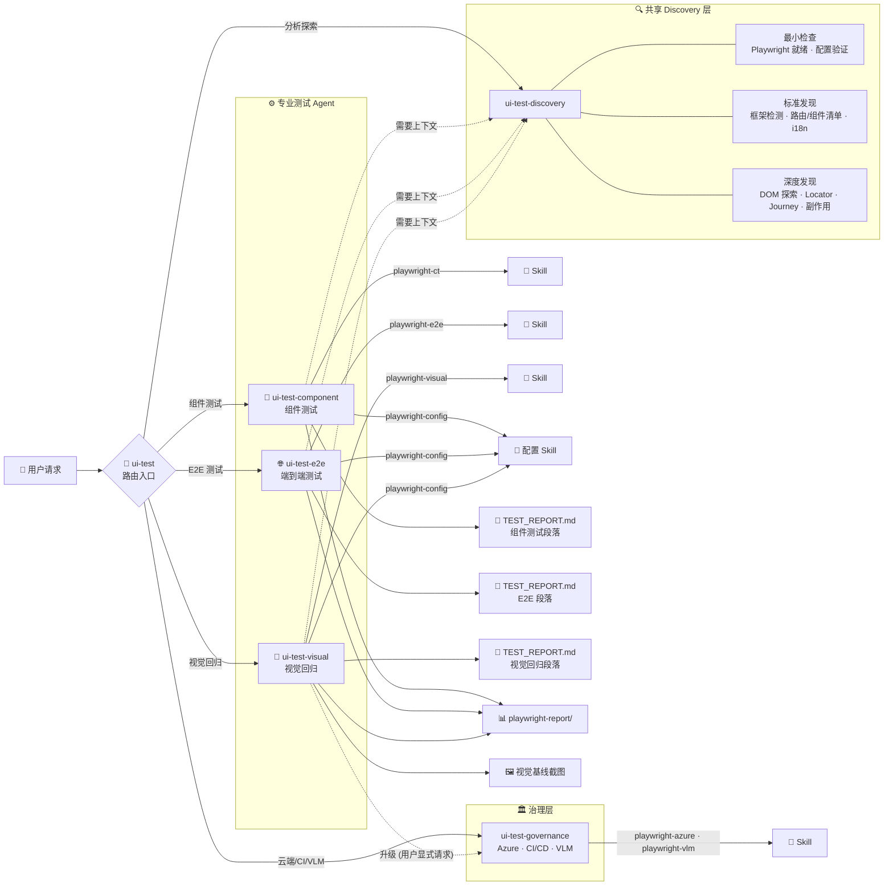
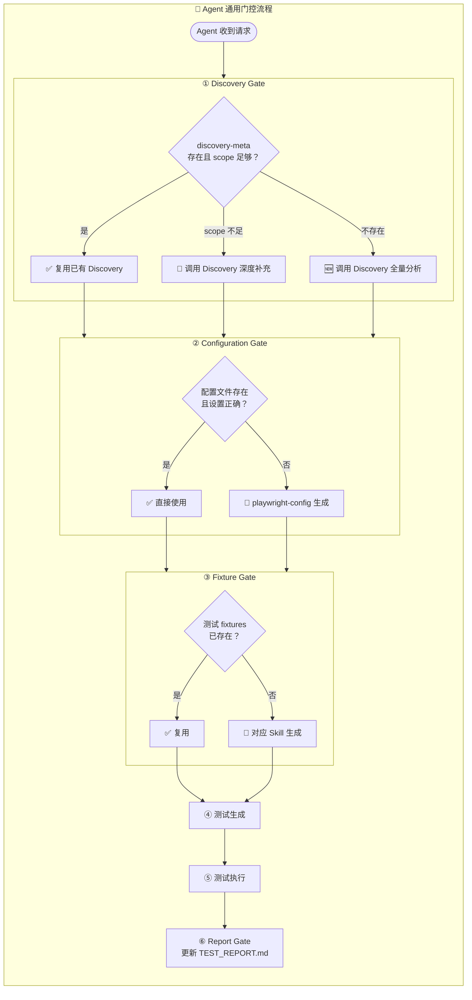
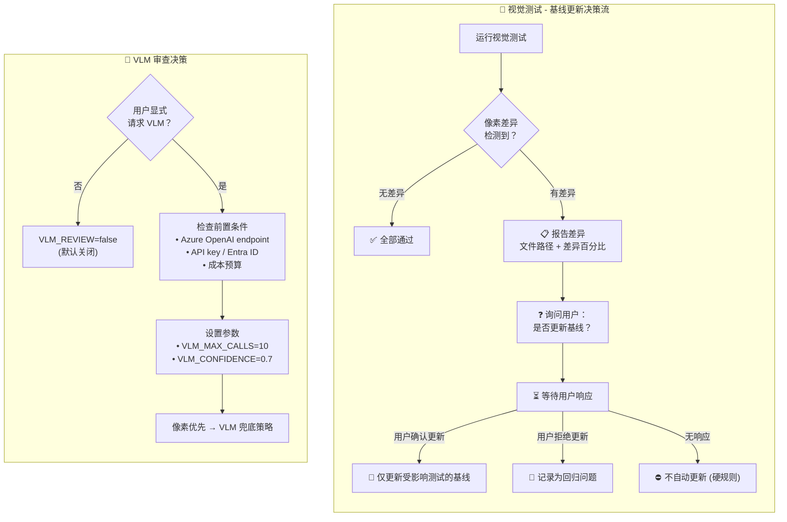
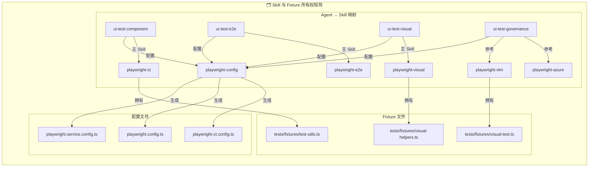

# TravelVista — 旅游目的地浏览网站

> React + TypeScript + Vite 单页应用，搭配 Playwright 多层自动化测试体系

[](https://nickhou1983.github.io/UI-test-Demo/)

## 项目概览

| 项目 | 说明 |
| --- | --- |
| 线上地址 | <https://nickhou1983.github.io/UI-test-Demo/> |
| 技术栈 | React 19 · TypeScript 5.9 · Vite 8 · Tailwind CSS 4 · react-i18next |
| 测试框架 | Playwright E2E / CT / Visual + VLM (可选) |

## 快速开始

```bash
# 安装依赖
npm install

# 启动开发服务器
npm run dev

# 生产构建
npm run build
```

## 测试命令

| 命令 | 说明 |
| --- | --- |
| `npm run test:ct` | 组件测试 (Playwright CT) |
| `npm run test:e2e` | 端到端测试 |
| `npm run test:visual` | 视觉回归测试 (VLM 关闭) |
| `npm run test:visual:vlm` | 视觉回归 + VLM 审查 |
| `npm run test:all` | 运行全部测试 |
| `npm run test:update-snapshots` | 更新视觉基线截图 |
| `npm run test:azure:e2e` | Azure 云端 E2E |
| `npm run test:azure:visual` | Azure 云端视觉回归 |

---

## UI-Test Agent 工作流架构

本仓库采用**分层路由 + 专业 Agent**的自动化测试架构，由 `ui-test` 入口统一调度，下辖 Discovery、Component、E2E、Visual、Governance 五个专业 Agent，配合 7 个 Playwright Skill 完成从发现到执行的全流程。

### 全局架构



### 路由决策说明

| 用户请求 | 路由目标 |
| --- | --- |
| 组件测试 / CT / props / events | `ui-test-component` |
| E2E / 页面流 / 用户旅程 | `ui-test-e2e` |
| 视觉回归 / 截图 / 基线管理 | `ui-test-visual` |
| 分析代码库 / 探索组件 | `ui-test-discovery` |
| Azure 云端 / CI/CD / VLM | `ui-test-governance` |

---

### Agent 通用门控流程

每个测试 Agent 在执行前必须通过 6 步门控，确保环境就绪、配置正确、产物可追溯。



| 门控 | 职责 | 失败时动作 |
| --- | --- | --- |
| Discovery Gate | 检查 `discovery-meta` 头，确认分析深度足够 | 调用 `ui-test-discovery` 补充 |
| Configuration Gate | 验证 Playwright 配置文件存在且设置正确 | 调用 `playwright-config` Skill 生成 |
| Fixture Gate | 确认 `tests/fixtures/` 中工具类就绪 | 调用对应 Skill 生成 |
| Report Gate | 更新 `docs/TEST_REPORT.md` 中本 Agent 拥有的段落 | 仅更新自己的段落，不覆盖他人 |

---

### 视觉测试关键决策流

视觉回归测试有两个核心决策路径：**基线更新策略** 和 **VLM 审查启用**。



> **⛔ 硬规则**：视觉测试失败后，**禁止自动更新基线**，必须等待用户确认。

---

### Skill 所有权与配置矩阵



| Agent | 主 Skill | 拥有的 Fixture | 报告段落 |
| --- | --- | --- | --- |
| `ui-test-component` | `playwright-ct` | `tests/fixtures/test-utils.ts` | 组件测试 |
| `ui-test-e2e` | `playwright-e2e` | — | 端到端测试 |
| `ui-test-visual` | `playwright-visual` | `tests/fixtures/visual-helpers.ts` | 视觉回归测试 |
| `ui-test-governance` | `playwright-azure` · `playwright-vlm` | `tests/fixtures/visual-test.ts` | — (治理策略) |

> `playwright-config` 是所有配置文件（CT / E2E / Azure）的**唯一生成者**。

---

### Discovery 输出契约

Discovery Agent 为下游 Agent 提供标准化的分析输出，通过 `discovery-meta` 头标记新鲜度和深度。

| 下游 Agent | 接收的 Discovery 数据 |
| --- | --- |
| **Component** | 组件名 · import 路径 · Props(必需/可选) · Events · Provider 依赖 |
| **E2E** | 路由清单 · 导航元素 · 交互流 · Locator 策略 · 用户旅程 · 副作用清单 |
| **Visual** | 页面清单 · 路由 URL · i18n 变体 · 响应式目标 · 副作用警告 |

```html
<!-- discovery-meta
  generated: {ISO-8601 timestamp}
  scope: minimum | standard | deep
  routes-found: {count}
  components-found: {count}
  i18n-detected: true | false
  side-effects-found: {count}
-->
```

---

## 项目结构

```text
├── src/
│   ├── components/     # 可复用 UI 组件
│   ├── pages/          # 页面组件
│   ├── data/           # 静态数据
│   ├── i18n/           # 国际化资源 (zh/en)
│   ├── types/          # TypeScript 类型定义
│   └── utils/          # 工具函数
├── tests/
│   ├── component/      # Playwright CT 组件测试
│   ├── e2e/            # Playwright E2E 端到端测试
│   ├── visual/         # Playwright 视觉回归测试
│   ├── fixtures/       # 测试工具 & Provider 包装
│   └── utils/          # 测试辅助工具
├── .github/
│   ├── agents/         # UI-Test Agent 定义
│   └── skills/         # Playwright Skill 定义
├── playwright.config.ts         # E2E + Visual 配置
├── playwright-ct.config.ts      # 组件测试配置
└── playwright.service.config.ts # Azure 云端配置
```

## License

MIT
